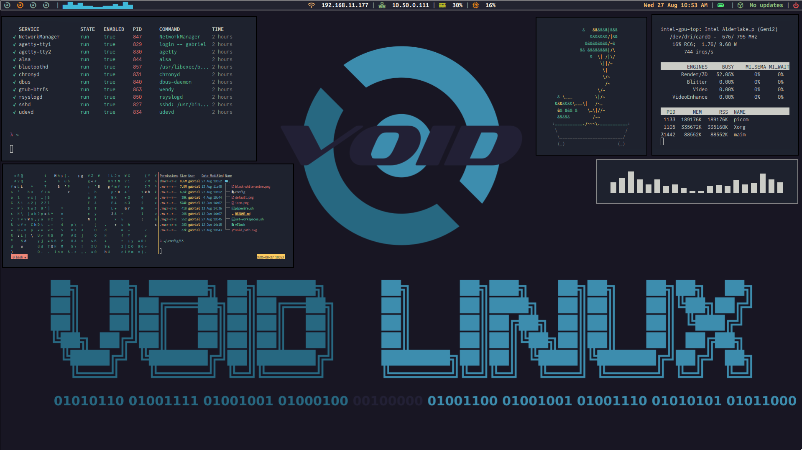

    <h1>
        
    </h1>

---
## 🦊 Welcome!

In this repository, you can find:
- My experiences with GNU/Linux systems
- General information that I find relevant
- My dotfiles
- Scripts and guides

### 👽 About me:
I currently work at an audiovisual solutions integration company, focusing on:
- streaming (IPTV/OTT)
- broadcast solutions (ISDB-T/Tb and DVB)
- network infrastructure (CDNs, transcoding, proxies and others)

---
### 💻 Dotfiles

You can check out my archives [here](https://github.com/gqtn/gqtn/tree/main/dotfiles). A brief summary of what I'm using:

| System | Name | Project site |
| --- | --- | --- |
| OS | Arch Linux | https://archlinux.org |
| TWM | i3wm | https://i3wm.org/ |
| Bar | Polybar | https://polybar.github.io/ |
| Menu | Rofi | https://github.com/davatorium/rofi |
| Terminal | Alacritty | https://alacritty.org/ |
| Compositor | Picom | https://github.com/yshui/picom |

---
### 🐧 For Void Linux users
Since I used Void Linux, here's a contribution from users who use it. Check out my [Void repository](https://github.com/gqtn/void-linux) for some interesting guides and ready-made templates.
