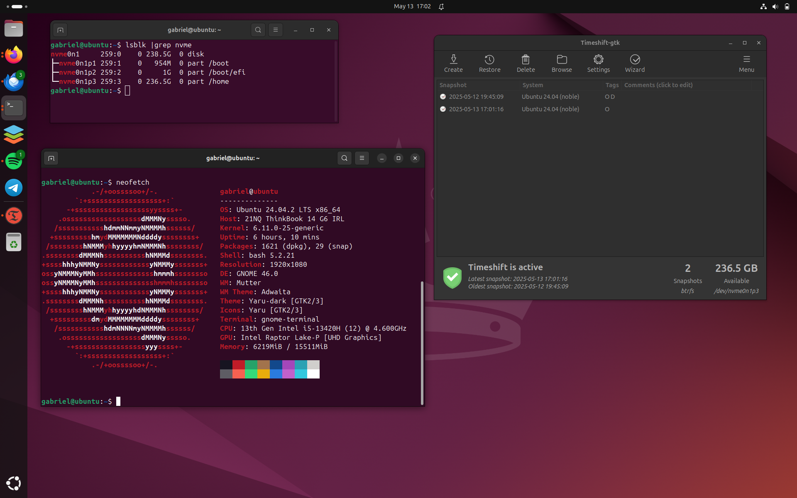

# Installing Ubuntu 24.04 LTS with BtrFS (for Timeshift snapshots)

You can install the system normally until the end prompt. You will se two options: **Continue testing** and **Restart now**; we need to make some changes to the system before we can restart the system, so click on the **Continue testing** button.

### BtrFS Setup

> A brief summary of home `btrfs` subvolumes work:
> When you create a subvolume it is like creating a new directory. You can create a snapshot of the subvolume and it will be like creating a copy of the directory. You can also create a snapshot of the entire filesystem and it will be like creating a copy of the entire filesystem. This is useful if you need to roll back the system to a previous state.

1. Umount everything with `sudo umount -a`
2. Mount the root partition with `sudo mount /dev/<sdX|nvme0n1pX> /mnt`
3. Copy the `resolve.conf` file: `sudo cp -vf /etc/resolv.conf /mnt/etc/resolv.conf`
4. Then create the first subvolume with: `sudo btrfs su snapshot /mnt/ /mnt/@`

> The 4 step will create a snapshot of the *root* partition thereby creating a *root* level subvolume.

5. Remove the main installed contents:
```
sudo rm -rv /mnt/{bin,bin*,boot,cdrom,etc,home,lib,lib*,media,mnt,opt,root,run,sbin,sbin*,snap,srv,sys,tmp,usr,var}
```
6. Now we can create the rest of the subvolumes:
```
sudo btrfs su create /mnt/@{home,cache,log,tmp,snapshots}
```
> *Note: If you want just the `@home`, you don't need to create the others.*

> **6a.** If you created the `@log` and `@cache`, you need to copy some contents as an archive to preserve the permissions and owership:
> `sudo cp -av /mnt/@/var/cache/* /mnt/@cache && rm -rv /mnt/@/var/cache/* || echo "No cache directory"`
> `sudo cp -av /mnt/@/var/log/* /mnt/@log && rm -rv /mnt/@/var/log/* || echo "No log directory"`

7. Umount the root partition with: `sudo umount /mnt`

### Remount and Chroot

Once the subvolumes are created and the contents of the `var/cache` and `var/log` directories are copied to the *cache* and *log* subvolumes, you can remount the *root* partition and chroot into the system. 
**Remember to mount according to the drive type and replace ‘X’ with the correct partition number!**

1. Mount the subvolumes as follows:
```
sudo mount -o subvol=@ /dev/<sdaX|nvme0n1pX> /mnt
sudo mount -o subvol=@home /dev/<sdaX|nvme0n1pX> /mnt/home
sudo mount -o subvol=@cache /dev/<sdaX|nvme0n1pX> /mnt/var/cache
sudo mount -o subvol=@log /dev/<sdaX|nvme0n1pX> /mnt/var/log
sudo mount -o subvol=@tmp /dev/<sdaX|nvme0n1pX> /mnt/var/tmp
sudo mount -o subvol=@snapshots /dev/<sdaX|nvme0n1pX> /mnt/.snapshots
```
2. Last mount the `EFI boot partition`:
```
sudo mount /dev/<sdaY|nvme0n1pY /mnt/boot/efi
```
3. Mount the rest:
```
for d in dev proc sys run; do sudo mount --rbind /$d /mnt/$d; done
```
4. Chroot into the environment: `sudo chroot /mnt /bin/bash`

### Grub and fstab

Because we're using subvolumes with *btrfs*, we need to regenerate the *grub* configuration file and update the *fstab* file.

1. First, the grub:
```
sudo grub-mkconfig -o /boot/efi/EFI/ubuntu/grub.cfg
```
Or it can be located in `/boot/efi/grub/grub.cfg`. If yes, create and copy the file in `/etc/efi/EFI/ubuntu`
And then:
```
sudo update-grub
```

2. Next, *fstab*: `sudo nano /etc/fstab`:
3. Edit the lines like:
```
# <file system> <mount point>   <type>  <options>       <dump>  <pass>

# !! EDIT !!
/dev/disk/by-uuid/673bef77-16c4-49cc-8c84-b62e194b55fu / btrfs ssd,noatime,space_cache=v2,compress=lzo,subvol=@ 0 0
/dev/disk/by-uuid/673bef77-16c4-49cc-8c84-b62e194b55fu /home btrfs ssd,noatime,space_cache=v2,compress=lzo,subvol=@home 0 0
# if you create others subvolumes, add it.

# !! DON'T CHANGE THE BOOT CONFIGS !!
# /boot was on /dev/nvme0n1p1 during curtin installation
/dev/disk/by-uuid/7c31420b-6e9c-4d4f-bfdd-5be2834dd818 /boot ext4 defaults 0 1

# /boot/efi was on /dev/nvme0n1p2 during curtin installation
/dev/disk/by-uuid/AF00-E3CC /boot/efi vfat defaults 0 1
```
4. You can exit `chroot` with `exit` command
5. Now you can reboot the system.
